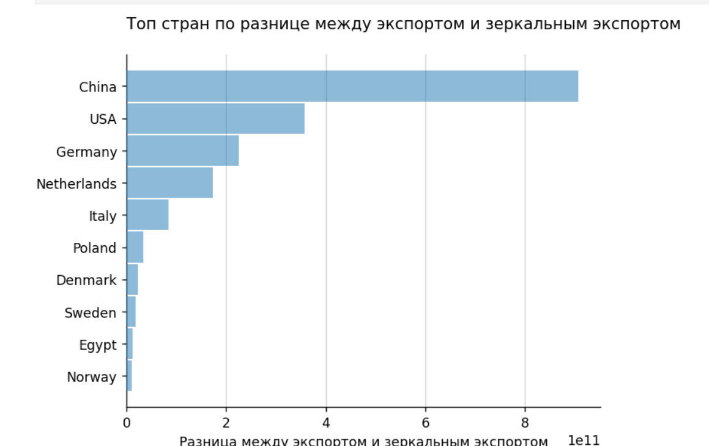

# Анализ данных экспорта нефти из базы данных ООН Comtrade

## Описание проекта

Этот проект направлен на анализ данных экспорта нефти из базы данных Comtrade Организации Объединённых Наций. Comtrade предоставляет подробную глобальную торговую статистику по продуктам и торговым партнёрам. В рамках проекта была выполнена задача по выявлению топ-50 стран по объёму экспорта нефти в 2019 году и расчёту их экспортных показателей и зеркального экспорта в 2023 году.

## Задача

1. Определить **топ-50 стран по экспорту нефти в 2019 году** на основе данных из базы данных Comtrade.
2. Подсчитать для этих стран значения **экспорта и зеркального экспорта нефти в 2023 году**.

## Описание данных

База данных Comtrade содержит:
- **Продукты**: Данные по экспорту и импорту различных категорий товаров, включая нефть.
- **Торговые партнёры**: Информация о странах-импортёрах и экспортёрах.
- **Ежегодная и ежемесячная статистика**: Подробные данные по объёмам торговли за разные периоды.

## Используемые инструменты

- **Языки программирования**: Python
- **Библиотеки**:
  - `pandas`: для обработки и анализа данных.
  - `numpy`: для расчётов.
  - `matplotlib` или `seaborn`: для визуализации экспортных данных (при необходимости).
  - `requests` и `json`: для работы с API, если данные были загружены напрямую из Comtrade API.

## Краткий вывод

Анализ выявил значительные расхождения между экспортом и зеркальным экспортом для ряда стран, таких как Китай, США и Германия. Это может быть связано с особенностями отчетности и сложности учета торговли нефтью. Эти различия важно учитывать при интерпретации данных международной торговли.

